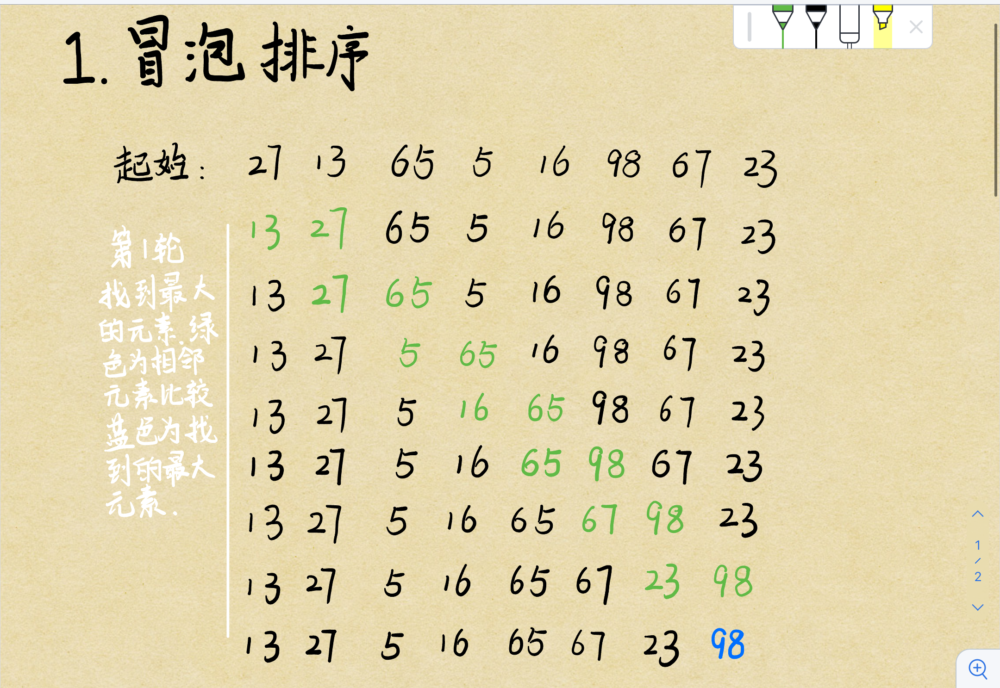
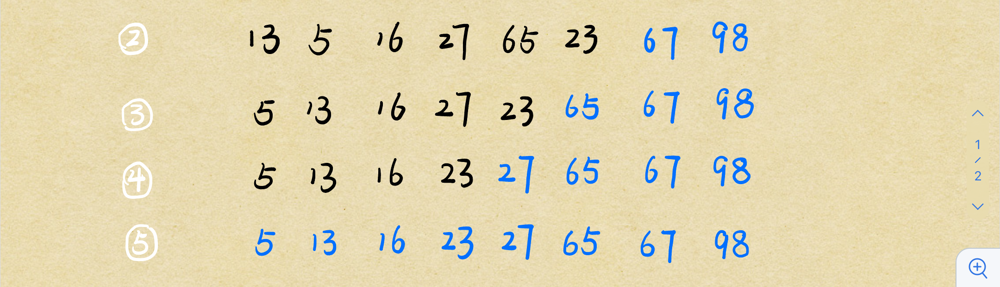
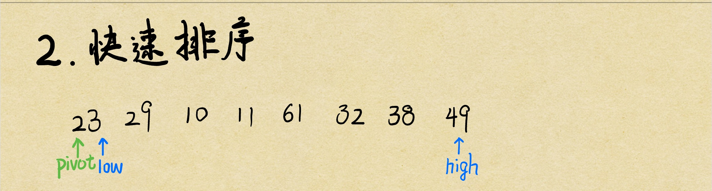
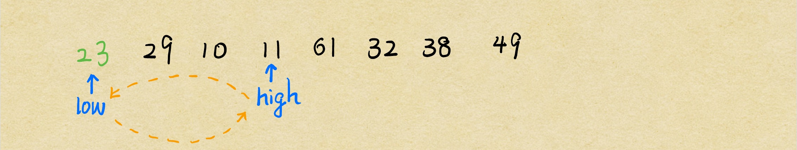
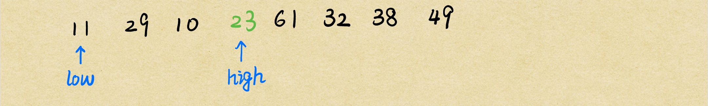
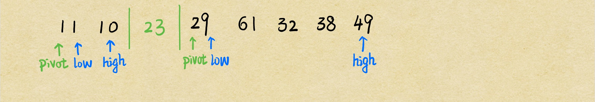

# 排序算法

## 选择排序算法

> 直接选择排序、堆排序

## 交换排序

> 冒泡排序、快速排序

## 插入排序

> 直接插入排序、折半插入排序、Shell排序

## 归并排序

## 桶式排序

## 基数排序

-----------------------------------------------------------------------------------------------------------------------------

## 冒泡排序算法

 从第一个元素开始，比较两个相邻的元素。若相邻的元素的相对位置不正确，则交换位置；否则比较后面两个相邻的元素。





八个元素最多需要七轮排序。

**核心代码：**

```java
		for(int i=0; i<a.length-1; i++) {
			for(int j=0; j<a.length-1-i; j++) {
				if(a[j] > a[j+1]) {
					int temp = a[j];
					a[j] = a[j + 1];
					a[j + 1] = temp;
				}
			}
		}
```

## 快速排序算法（基础版）

定义3个指针（high， low， pivot），要求low指向的元素**小于等于**pivot指向的元素；high指向的元素**大于等于**pivot指向的元素。



首先，指向high的指针先向左移动（依次比较），若遇到比pivot指向的元素小的元素停下。



将high指向的元素和low指向的元素（此时low和pivot指向同一元素）换位置。



然后low开始向右移动（依次比较），若遇到比pivot指向的元素大的元素停下。


将high指向的元素和low指向的元素换位置。


然后，high再向左移动，找到比low指向元素小的元素停下。


同理，将low指向的元素和high指向的元素换位置。


至此，第一轮排序结束。23（pivot元素）左边都是比它小的元素，右边都是比它大的元素。然后以pivot指向的元素为分界线，再对左右两边的小数组进行上述操作。



代码实现：

```java
package order;
//快速排序算法
public class QuickSort {
	public static void main(String[] args) {
		int[] a;
		a = new int[] {23, 29, 10, 11, 61, 32, 38, 49};
		int low = 0;
		int high = a.length-1;
		
		QuickSort quicksort = new QuickSort();
		quicksort.qSort(a, low, high);
		
		for(int i=0; i<a.length; i++) {
			System.out.print(a[i] + " ");
		}
	}
	
	public void qSort(int[] a, int low, int high) {
		int pivot;

		QuickSort qsort = new QuickSort();
		
		if(low < high) {
			pivot = qsort.partition(a, low, high);
			qsort.qSort(a, low, pivot-1);
			qsort.qSort(a, pivot+1, high);
		}
	}
	
	public int partition(int[] a, int low, int high) {
		int pivotKey = a[low];

		while(low < high) {
			while(low<high && a[high]>=pivotKey) {
				high--;
			}
			if(low<high) {
				int temp = a[low];
				a[low] = a[high];
				a[high] = temp;
			}
			while(low<high && a[low]<=pivotKey) {
				low++;
			}
			if(low<high) {
				int temp = a[low];
				a[low] = a[high];
				a[high] = temp;
			}
		}
		return low;
	}
}
```

