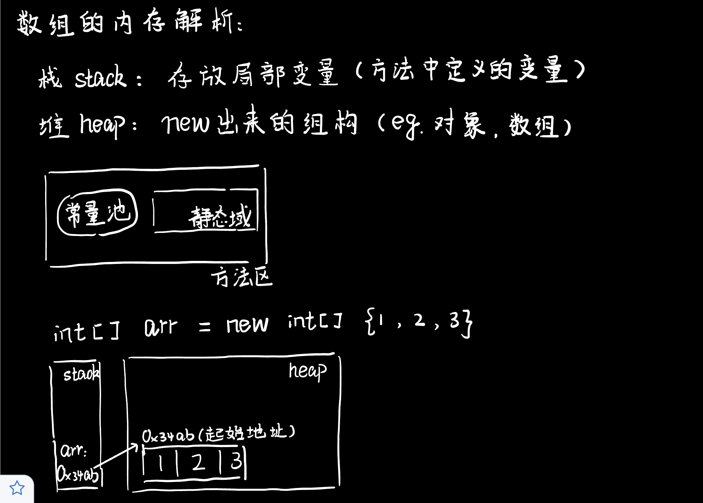
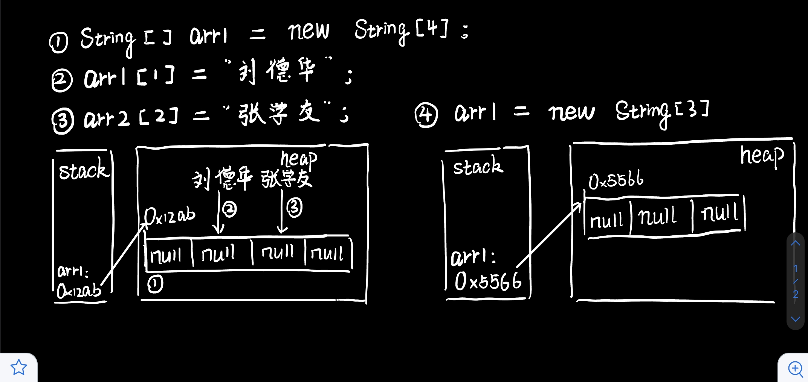

# 数组基础

**复习：** 声明：`int num;`    初始化：`num=10;`   声明+初始化：`int id = 1001;`

## 一维数组

声明：`int[] a;`

* 静态初始化：数组的初始化和数组元素的赋值操作同时进行。
  
  ```java
  int[] a;//声明
  a = new int[]{1001, 1002, 1003};
  ```

* 动态初始化：数组的初始化和数组元素的赋值操作分开进行。
  
  ```java
  int[] b;//声明
  b = new int[3];//初始化
  b[0] = 1001;
  b[1] = 1002;
  b[2] = 1003;
  ```

* 不论动态静态，声明都可以和初始化合在一起写。
  
  ```java
  String[] names = new String[3];
  ```

获取数组长度：使用属性`length`

```java
System.out.println(names.length);
```

数组元素的默认初始值：

* 整型：0
* 浮点型：0.0
* 字符型：0或'\u0000'，不是'0'（输出出来是空值）
* 布尔型：false
* 数组元素（引用数据）：null

数组的内存解析：





## 二维数组

1. 二维数组的声明和初始化
   
   ```java
   int[][] arr1 = new int[][]{{1,2}, {3,4}};   //静态初始化
   String[][] arr2 = new String[3][2];   //动态初始化
   ```

2. 二维数组初始值
   
   ```java
   int[][] arr = new int[4][5];
   //在未赋值的情况下，arr[0]中只是存了指向下一级数组的地址
   System.out.println(arr[0]);   //输出地址值
   Syetem.out.println(arr[0][0]); //输出0
   ```
   
   * 初始化方式一：
     
     ```java
     int[][]arr = new int[4][3];
     ```
     
     外层数组元素初始化值：地址值；内层数组元素初始化值：与一维数组初始化相同。
   
   * 初始化方式二：
     
     ```java
     int[][] arr = new int[4][];
     ```
     
     外层数组元素的初始化为null；内层数组元素初始化为：不能调用，否则报错。

## 特殊写法

一维数组：`int[ ] x` 或 `int x[ ]`

二维数组：`int[ ][ ] y` 或 `int[ ] y[ ]` 或 `int y[ ][ ]`

一维、二维一起写：

```java
int[]x, y[]; //将int[]x 和int[]y[] 合在一起写
x = new int[] {1,2,3};
y = new int[][] {{1,2,3}, {0,0,0}};
```

## Arrays工具类

------------------------------

`boolean equals(int[] a, int[] b)`：判断两个数组是否相同。

提供的Object类写法如下（可以进行重写）

```java
public boolean equals(Object obj) {
    return (this == obj); //比较两个数组的内存地址是否相同
}
```

`String toString(int[] a)`：输出数组信息。

提供的Object类写法如下（可以进行重写）

```java
public String toString() {
    //返回此对象所在的类及对应的堆空间对象实体的首地址值
    return getClass().getName() + "@" + Integer.toHexString(hashCode());
}
```

例如：

```java
Person p1 = new Person();
System.out.println(p1.toString());//TestEquals.Person@15db9742
System.out.println(p1);//TestEquals.Person@15db9742 输出的时候默认调用Objec类toString()方法
```

`void fill(int[] a, int fromIndex, int toIndex, int val)`：将指定值填入到数组中。其中`a`是目标数组，`fromIndex`是使用指定值填充的第一个元素的索引（包括），`toIndex`是使用指定值填充的最后一个元素的索引（不包括），`val`是存储在数组所有元素中的值。调用时，可以加上`int fromIndex, int toIndex`，不加范围就是整个数组。

例如：

```java
import java.util.Arrays;

public class FillTest {
    public static void main(String args[]) {
        int array[] = new int[6];
        Arrays.fill(array, 100);
        for (int i = 0, n = array.length; i < n; i++) {
            System.out.println(array[i]);
        }

        System.out.println("***********");

        Arrays.fill(array, 3, 6, 50);
        for (int i = 0, n = array.length; i < n; i++) {
            System.out.println(array[i]);
        }
    }
}
//运行结果如下：
100
100
100
100
100
100
**********
100
100
100
50
50
50
```

`void sort(int[] a)`：对数组进行升序排序。

`int binarySearch(int[] a, int key)`：对**排序**后的数组进行二分法检索指定值。

* 找到的情况下：如果key在数组中，则返回搜索值的索引。

* 找不到的情况下：
  
  > 搜索值是数组元素，从0开始计数，得搜索值的索引值；
  > 
  > 搜索值不是数组元素，且在数组范围内，从1开始计数，得“ - 插入点索引值”；
  > 搜索值不是数组元素，且大于数组内元素，索引值为 – (length + 1);
  > 搜索值不是数组元素，且小于数组内元素，索引值为 – 1。

例如：

```java
int a[] = new int[] {1, 3, 4, 6, 8, 9};  
int x1 = Arrays.binarySearch(a, 5);  
int x2 = Arrays.binarySearch(a, 4);  
int x3 = Arrays.binarySearch(a, 0);  
int x4 = Arrays.binarySearch(a, 10);
//x1=-4   x2=2   x3=-1   x4=-7
```

## 常见异常

---------

1. `ArrayIndexOutOfBoundsException`：数组角标越界异常。
   
   合理范围：[0, arr.length-1]
   
   越界：arr[-1]，arr[arr.length]

2. `NullPointerException`：空指针异常
   
   例如：
   
   ```java
   int[] arr = null;
   int a = arr[0]; //报错！在数组arr为null的情况下调用元素会报错
   ```
